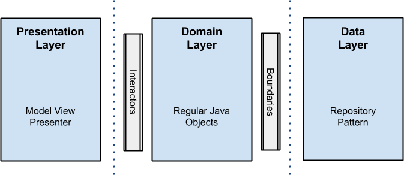

# Summary
1. [Introduction](#introduction)
   * [Overview](#overview)
   * [Showcase](#showcase)
2. [Architecture](#architecture)
   * [Clean Architecture](#clean-architecture)
   * [Design Patterns](#design-patterns)
   * [Quality Assurance](#tests)
   * [Frameworks](#frameworks)
   * [End Points](#end-points)
3. [Application Setup](#setup)   
4. [License](#license)

<a name="introduction" />

# Introduction

<a name="overview" />

## Overview
This a simple project use hard Rxjava with compose and remove responsible to presenter

<a name="showcase" />

## Showcase

  

<a name="architecture" />

# Architecture

<a name="clean-architecture" />
-----------------

Architectural approach
-----------------

Architectural reactive approach
-----------------

<a name="design-patterns" />

## Design Patterns
 - **Singleton**: this pattern is used mainly to offer a single instance of presenters for their respective views. Its implementation happens thanks to Dagger2 @Singleton annotation;
 - **Observer**: this pattern is largely used in order to issue network events that trigger database actions or UI updates. The variant employed is observed based on bus, being all call routed to a class that holds reference to all subscribers;
 - **Delegate**: this pattern is used in more than one place in the Application, for instance, with Postman and Router classes. The idea is to decouple classes that play distinct roles in the app - as the ones responsible for network communication for instance. That way, if any maintenance is required on them it is not passed beyond the class that gather all calls;
 - **Factory**: the application uses Factory Pattern on default Dagger2 implementation as well as to acquire End Points references for instance;

<a name="tests" />

## Quality Assurance

One of the most importants gains that the MVP pattern brings to the project is the fact that all business logic gets isolated on Presenter Layer, it means, all code worthy to be tested is well encapsulated on classes with low dependency on OS components. This pattern alied with a Dependency Injection Container and Mock Frameworks (such as [Mockito](http://site.mockito.org/).   
<a name="frameworks" />

## Frameworks
 - [**Retrofit**](https://square.github.io/retrofit/): _"(...) A type-safe HTTP client for Android and Java;
     - [**OkHttp**](http://square.github.io/okhttp/): “(...) HTTP is the way modern applications network. It’s how we exchange data & media. Doing HTTP efficiently makes your stuff load faster and saves bandwidth.
       OkHttp is an HTTP client that’s efficient by default:
          - HTTP/2 support allows all requests to the same host to share a socket.
          - Connection pooling reduces request latency (if HTTP/2 isn’t available).
          - Transparent GZIP shrinks download sizes.
          - Response caching avoids the network completely for repeat requests.

        OkHttp perseveres when the network is troublesome: it will silently recover from common connection problems. If your service has multiple IP addresses OkHttp will attempt alternate addresses if the first connect fails. This is necessary for IPv4+IPv6 and for services hosted in redundant data centers. OkHttp initiates new connections with modern TLS features (SNI, ALPN), and falls back to TLS 1.0 if the handshake fails.
        Using OkHttp is easy. Its request/response API is designed with fluent builders and immutability. It supports both synchronous blocking calls and async calls with callbacks. OkHttp supports Android 2.3 and above. For Java, the minimum requirement is 1.7…”_
     - [**Gson**](https://github.com/google/gson): _“(...) A Java serialization/deserialization library that can convert Java Objects into JSON and back…”_
     - [**RxAndroid**](https://github.com/ReactiveX/RxAndroid): _“(...) ReactiveX is a combination of the best ideas from the Observer pattern, the Iterator pattern, and functional programming...”_
 - [**Dagger 2**](https://google.github.io/dagger/): a dependency Injector for Android and Java, used to grant one of the S.O.L.I.D. principles for OO programming (Dependency Inversion Principle). Besides allowing the high level class to not depend upon low level ones, it makes Unit Test easier to perform with the help of a mocking framework i.e. Mockito;

<a name="end-points" />

## End points
 - [**Random user API**](https://randomuser.me/): _“(...) A free, open-source API for generating random user data. Like Lorem Ipsum, but for people.”_

<a name="setup" />

# Application Setup
In order to make this application work, follow the steps below:

1. Have a Android Studio 3.6
1. Clone the repository to your local machine;
2. Build the project.

<a name="license" />

## License
Copyright 2017 Uzias Santos Ferreira

Licensed under the Apache License, Version 2.0 (the "License");
you may not use this file except in compliance with the License.
You may obtain a copy of the License at

    http://www.apache.org/licenses/LICENSE-2.0

Unless required by applicable law or agreed to in writing, software
distributed under the License is distributed on an "AS IS" BASIS,
WITHOUT WARRANTIES OR CONDITIONS OF ANY KIND, either express or implied.
See the License for the specific language governing permissions and
limitations under the License.
